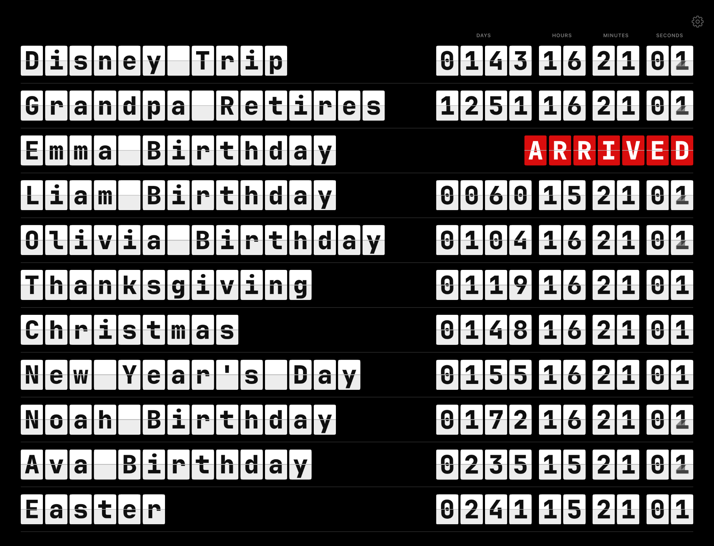
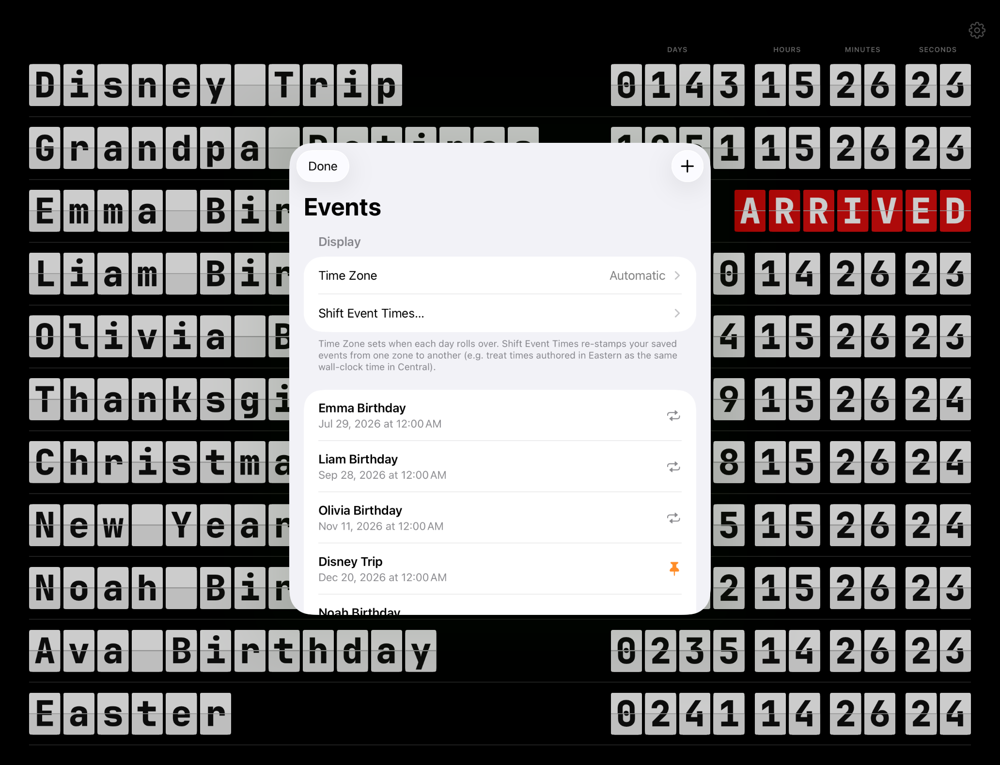
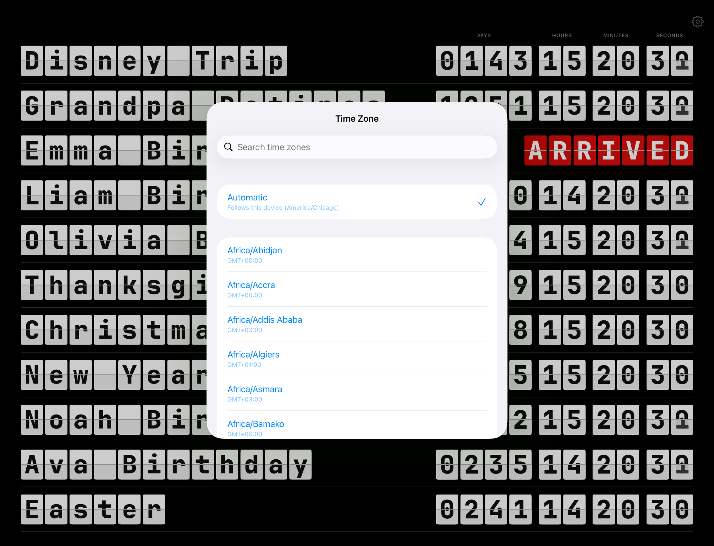
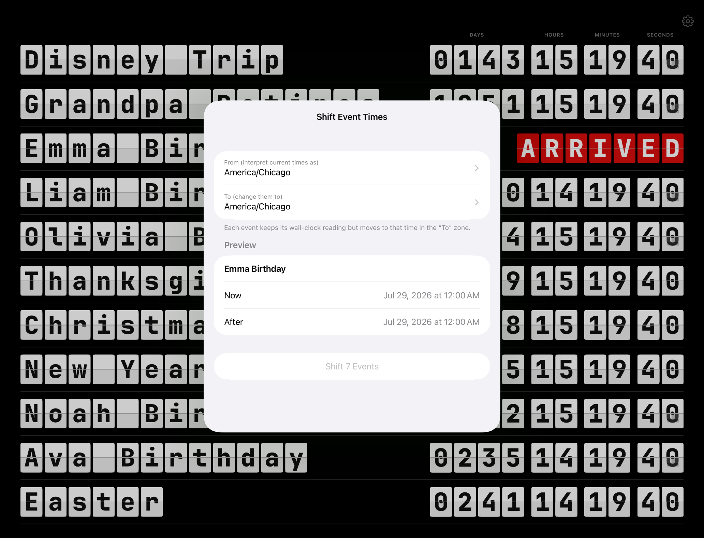

# FamilyCountdown

A native iPad (landscape) app that mimics the FlipClock web page: a black
"train-station board" listing events by name with a split-flap countdown of
days / hours / minutes / seconds until each one. On the event's day the digits
are replaced by a red **ARRIVED**; the day after, repeating events (birthdays)
roll to next year and one-time events drop off. US holidays (New Year's, Easter,
July 4th, Thanksgiving, Christmas) are added automatically. The list is edited
and stored on-device — no server or password.



The gear opens the editor: set the display time zone, shift saved event times
between zones, and add / edit / delete events.



**Time Zone** picks which zone drives day boundaries (defaults to Automatic, following the device):



**Shift Event Times** re-stamps every saved event's wall-clock reading from one zone to another, with a live preview:



## Build & run

The Xcode project is generated with [XcodeGen](https://github.com/yonasstephen/xcodegen)
from `project.yml`. It's already generated (`FamilyCountdown.xcodeproj`), but to
regenerate after changing `project.yml`:

```sh
xcodegen generate
```

Open `FamilyCountdown.xcodeproj` in Xcode and run on an iPad simulator or device,
or from the command line:

```sh
xcodebuild -scheme FamilyCountdown \
  -destination 'platform=iOS Simulator,name=iPad Pro 13-inch (M5)' build
xcodebuild -scheme FamilyCountdown \
  -destination 'platform=iOS Simulator,name=iPad Pro 13-inch (M5)' test
```

## Layout

```
FamilyCountdown/
  Models/      CountdownEvent, EventStore, HolidayProvider, CountdownEngine
  Views/       ContentView (board), EventRow, FlipClock/FlipGroup/FlipDigit (split-flap),
               EventEditorList, EventEditor
  Resources/   SplitFlapTV fonts, SeedEvents.json (first-launch seed)
  Info.plist   landscape-only, bundled fonts
FamilyCountdownTests/   holiday math, roll-forward, ARRIVED, store round-trip
```

## Notes

- **Split-flap animation**: `FlipDigit` recreates the PQINA two-leaf mechanism —
  the old top leaf folds down (0°→-90°) and the new bottom leaf drops and bounces
  to settle, 800 ms with an ease-out-bounce curve, staggered 50 ms right-to-left
  across each digit group.
- **Font & tiles**: the split-flap tiles are drawn in SwiftUI (white flap, dark
  glyph, hairline seam, rounded corners); the character itself is
  [JetBrains Mono](https://github.com/JetBrains/JetBrainsMono) (SIL OFL, bundled
  with its `JetBrainsMono-OFL.txt` license). Names and digits share the same
  `TileFace`, so they read as identical physical flaps.
- **Storage**: `Documents/FamilyCountdownEvents.json`, seeded on first launch from
  the bundled `SeedEvents.json`; the JSON format matches the original web page so
  files interchange.
- **Data model**: `label`, `targetDate` (ISO-8601 with tz offset), `pinned`
  (sorts to the top), `repeats` (rolls to next year after arriving).
- **Time zone**: settable in the editor (gear → Display → Time Zone). Defaults to
  **Automatic**, which follows the device (kept current from the network). The zone
  controls day boundaries (ARRIVED / roll-forward), holiday midnights, and the
  editor's date fields. The countdown numbers themselves are absolute and don't
  change with the zone.
